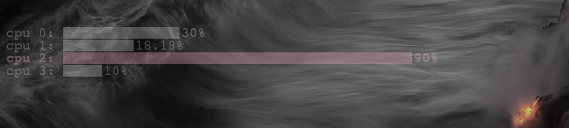

# cpu-usage

An [uebersicht](http://tracesof.net/uebersicht/)
widget that displays cpu usage per core as a
bar chart using the [D3](http://d3js.org/) library.

## Install

Depends on [cpu_usage](https://github.com/aavilahe/cpu_usage) or
something with similar output installed in `~/bin`.

- Put `cpu-usage.widget` in your widgets directory
(typically `~/Library/Application Support/Übersicht/widgets`).
- If needed, put the D3 library (`d3js`) there, too.

Or, `make install`. Watch out for spaces in paths.

## License

cpu-usage Copyright (c) 2015 Aram Avila-Herrera. Released under GNU GPL v3 license.
See [`LICENSE`](./LICENSE) for details.

D3 Library Copyright (c) 2010-2015 Mike Bostock. Released under BSD license.
See [`d3js/D3-LICENSE`](./d3js/D3-LICENSE) for details.
